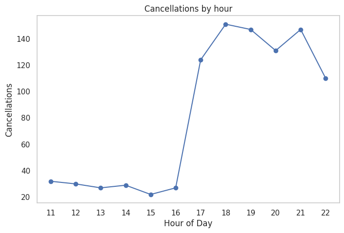

# Food Delivery Business Analytics Project
Team members: Tsyr Rau Chen, Arailym Duisengali, Sheikh Noohery, Lo Ying Wu, and Kuan Rong Yang

## Project Overview

This project aims to identify the core strengths and performance drivers of a food-delivery business.
We explored multiple analytical questions and built several models to understand:
- customer behavior
- operational efficiency
- order patterns and trends
- high-value cuisines and restaurants
- cancellation and delivery dynamics
The goal is to provide data-driven insights that can support strategic decision-making.

## Tools & Technologies Used
**SQLite** — database for storing and querying operational data

**Python** — main language for analysis and modeling
- Pandas (data manipulation)
- NumPy (numerical operations)
- Scikit-Learn (machine learning models)
- Matplotlib & Seaborn (visualizations)

**draw.io** — diagramming / workflow charts

## Key Analytical Questions answered using SQL:
1. Which cuisine types generate the highest average order value?
2. How often and how recently do customers place orders?
3. Which delivery partners are fastest and which are slowest?
4. During which hours or days are cancellations most common?
5.  How does tip percentage vary across different order amounts?

## Models & Methods

### Models
| Model                                      | Purpose                                                     |
| ------------------------------------------ | ----------------------------------------------------------- |
| **Linear Regression**                      | Establish baseline performance and interpret feature impact |
| **Polynomial Regression (2nd–4th degree)** | Capture non-linear trends in business operations            |
| **Random Forest**                          | Improve predictive accuracy and handle complex interactions |

### Evaluation Metrics
| Metric | Purpose |
|--------|---------|
| **MAE (Mean Absolute Error)** | Measures the average absolute prediction error |
| **RMSE (Root Mean Squared Error)** | Evaluates model error and penalizes larger deviations |

## Results Summary supported with visualizations:
Found peak cancellation hours between 17:00–22:00

## How to Run the Project
To explore the project, simply open the notebooks inside the notebooks/ folder.
All required libraries are listed in requirements.txt.

## Diagrams
All process maps and architecture diagrams can be found in the diagrams/ folder.
Designed using draw.io and python

## Contributors names and contact info
- Tsyr Rau Chen, () 
- Arailym Duisengali, (araikinn@bu.edu)
- Sheikh Noohery, (noohery@bu.edu)
- Lo Ying Wu, ()
- Kuan Rong Yang, (yangkr@bu.edu)

